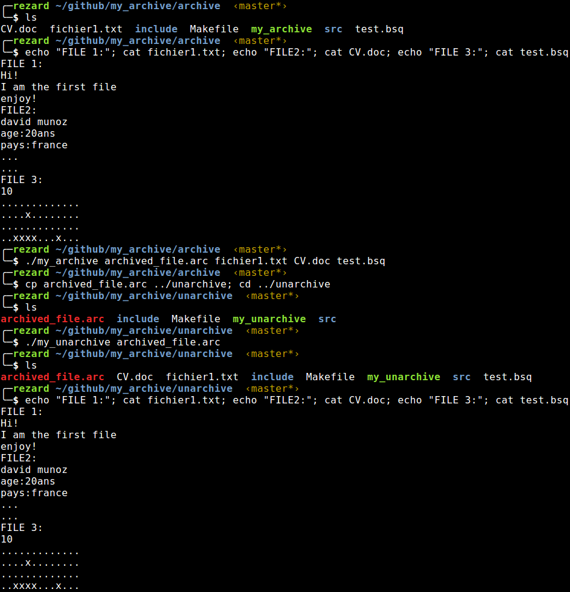

# my_archive
Epitech first year project : [CPE] my_archive

Deadline : 2 days

Beginning of the project : 08/01/2016, 19h00

Group size : 2 persons

Contributor : counil_m

# my_archive

my_archive is a program file archiver utility for unix.

my_unarchive is a program file unarchiver utility for unix.

## Getting started

These instructions will allow you to obtain a copy of the operational project on your local machine for development and testing purposes.

### Prerequisites

What do you need to install the software and how to install it?

```
gcc
make
```

### Installation

Here's how to start the project on your computer

Clone and go in the directory my_archive

Project compilation

```
make
```

Running project

Archive:
```
cd archive
make
./my_archive [NAME_FOR_ARCHIVED_FILE.arc] [FILE1] [FILE2] ...
```
Unarchive:
```
cd unarchive
make
./my_unarchive [NAME_OF_ARCHIVED_FILE.arc]
```

## Screenshot



## Build with

* [C](https://en.wikipedia.org/wiki/C_(programming_language))

## Autors

* **David Munoz** - [DavidMunoz-dev](https://github.com/davidmunoz-dev)
